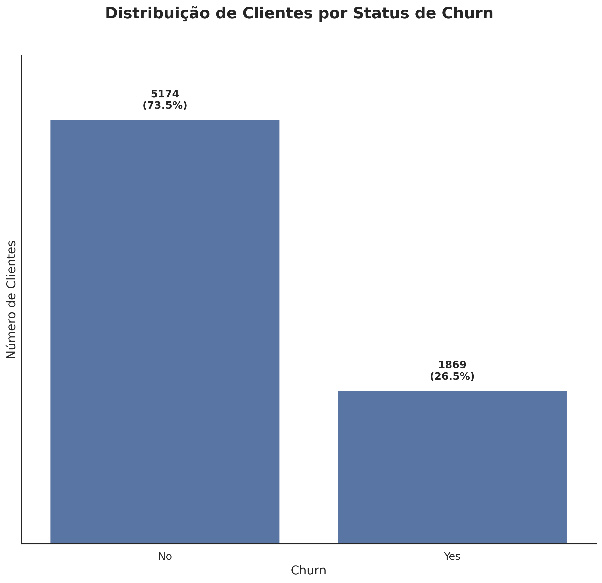
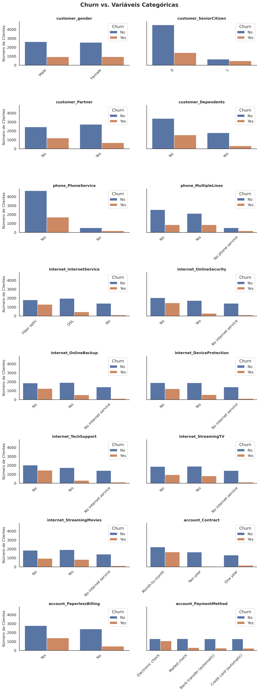
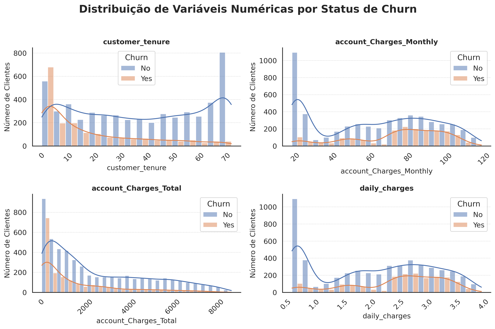
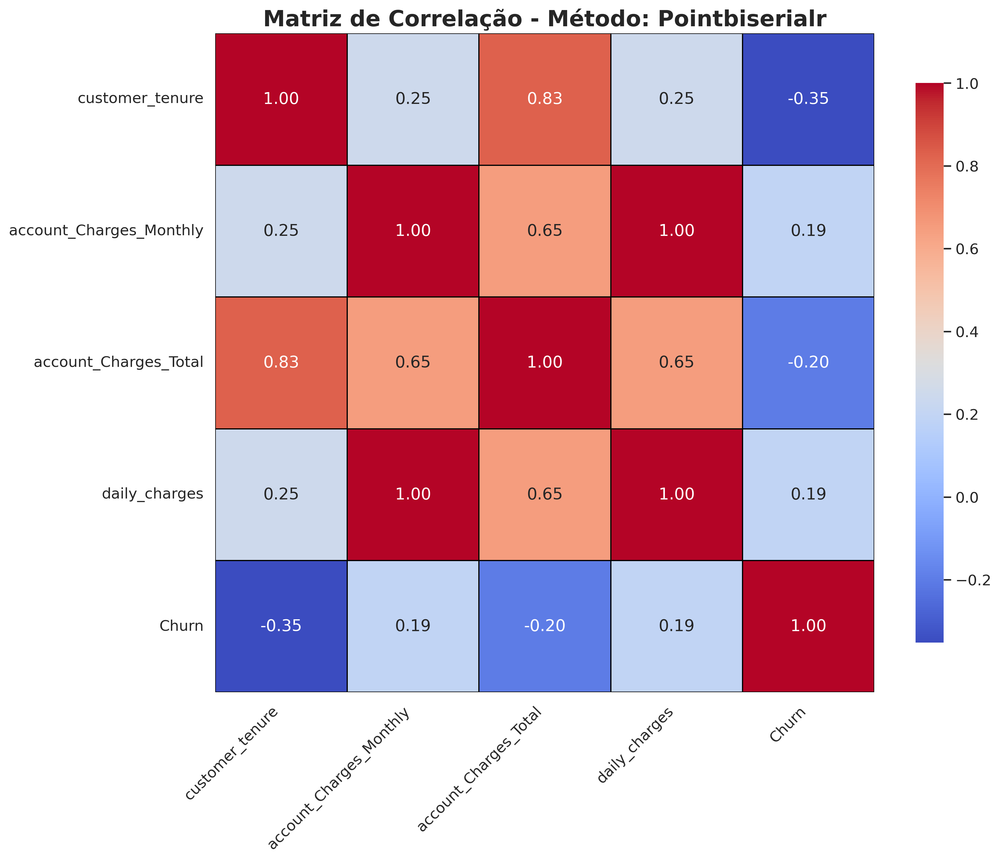

# Desafio Telecom X – Análise de Evasão de Clientes

Este projeto é parte do desafio da Alura, onde fui convidado a analisar os dados de evasão de clientes da Telecom X. A empresa está enfrentando um problema sério com cancelamentos e quer entender os motivos por trás disso.

Meu foco foi coletar, tratar e explorar os dados para identificar padrões que expliquem a saída dos clientes. O objetivo é fornecer insights claros para que a equipe de Data Science possa avançar na criação de modelos preditivos e, assim, ajudar a empresa a reduzir o churn.

Embora esta seja uma análise inicial, o desafio foi fundamental para exercitar o senso crítico, a análise descritiva, o uso de Python, versionamento com Git e a organização da estrutura do projeto.

## O que tem aqui

- Extração dos dados a partir de uma "API" (link raw do GitHub)  
- Limpeza e transformação dos dados (ETL)  
- Análise exploratória (EDA) para entender o comportamento dos clientes  
- Visualizações que mostram tendências e pontos críticos  

## Exemplos de Visualizações

A seguir, alguns dos gráficos produzidos durante a análise exploratória:

### Distribuição de churn (cancelamento vs permanência)  

---

### Churn por variáveis categóricas (contrato, tipo de internet, serviços adicionais)  

---

### Churn por variáveis numéricas (tenure, cobranças)  

---

### Correlação entre variáveis (Pearson e Point-Biserial)
 

---

## O que aprendi/pratiquei

- Consumo de "APIs" e leitura de dados em formato JSON  
- Manipulação e limpeza de dados com `pandas`  
- Criação de visualizações estratégicas com `matplotlib` e `seaborn`  
- Aplicação do fluxo de ETL para estruturação dos dados  
- Uso de técnicas estatísticas para entender relações entre variáveis  
- Extração de insights relevantes a partir de dados brutos  
- Estruturação de projetos com boas práticas de versionamento (`Git`)  

## Conclusões

A análise exploratória revelou padrões importantes no comportamento dos clientes da Telecom X:

- **Tempo de relacionamento (tenure)** é o principal indicador de churn: clientes com pouco tempo de casa cancelam com muito mais frequência.  
- **Tipo de contrato** tem forte impacto: planos mensais concentram a maioria dos cancelamentos, enquanto contratos anuais ou bienais retêm melhor os clientes.  
- **Serviços adicionais**, como **Online Security** e **Tech Support**, estão associados a menor churn — indicando que oferecer suporte e segurança pode melhorar a retenção.  
- **Cobranças mensais mais altas** tendem a estar associadas a maiores taxas de churn, embora a correlação não seja tão forte.  
- **Variáveis demográficas básicas** (como gênero e dependentes) não mostraram relação significativa com o cancelamento.  

Esses insights ajudam a entender melhor os fatores que influenciam a evasão de clientes e fornecem uma base sólida para o desenvolvimento de modelos preditivos e ações estratégicas de retenção.

## Próximos passos

Esta análise exploratória serve como base para a próxima etapa do projeto, que envolverá a criação de modelos preditivos para identificar clientes com maior risco de evasão. Essa continuação será desenvolvida em outro repositório, que será publicado em breve.

Meu objetivo aqui foi entregar uma análise clara, objetiva e útil, servindo como ponto de partida para que a equipe possa avançar com segurança na modelagem e nas estratégias de retenção.
